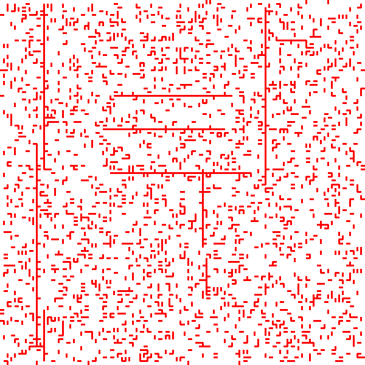
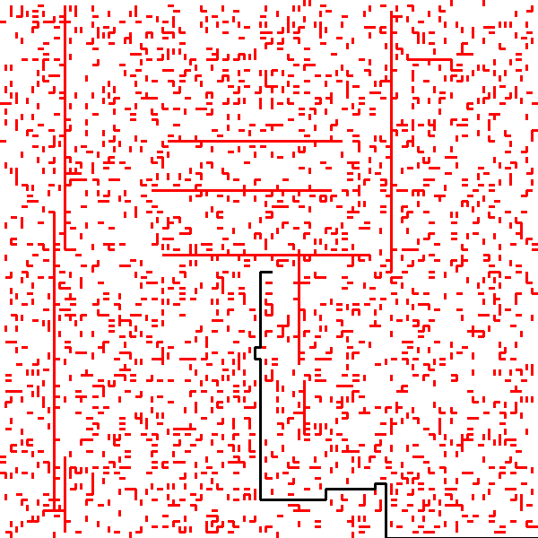

# Car Solver

## Requirement
* pillow

## Step to run
Chạy maze_solve.py với 2 tham số lần lượt `method` và `inputfile`. trong đó `method` chỉ nhận 1 trong 2 giá trị `ucf` hoặc `bfs`. VD:  
> python maze_solve.py ucf car_large

Khi chạy sẽ sinh bản đồ và path trong thư mục `images`

 

Output cho ucf car_large
> Error wall: [47, 89, 64, 71]  
> Error wall: [5, 90, 31, 42]  
> Error wall: [56, 98, 48, 7]   
> ...  (Các tường bị chéo không xét, do trong gen_map có k = 4 nhưng không được xử lý)  
>Error wall: [47, 74, 64, 71]  
>Error wall: [47, 89, 64, 71]  
>Error wall: [5, 90, 31, 42]  
>Error wall: [56, 98, 48, 7]  
>solving ...  
>Min cost 197 Done in 7.546595096588135  
>Tracing...  
>Num step: 82  
>Found path:  
>-> (99, 99, 0, 0)  
>-> (99, 99, 3, 0)  
>-> (98, 99, 3, 1)  
>-> (96, 99, 3, 2)  
>-> (93, 99, 3, 3)  
>-> (90, 99, 3, 3)  
>-> (87, 99, 3, 3)  
>-> (84, 99, 3, 3)  
>-> (81, 99, 3, 3)  
>-> (78, 99, 3, 3)  
>-> (75, 99, 3, 3)  
>-> (72, 99, 3, 3)  
>-> (70, 99, 3, 2)  
>-> (69, 99, 3, 1)  
>-> (69, 99, 3, 0)  
>-> (69, 99, 2, 0)  
>-> (69, 98, 2, 1)  
>-> (69, 97, 2, 1)  
>-> (69, 96, 2, 1)  
>-> (69, 96, 2, 0)  
>-> (69, 96, 3, 0)  
>-> (68, 96, 3, 1)  
>-> (68, 96, 3, 0)  
>-> (68, 96, 2, 0)  
>-> (68, 95, 2, 1)  
>-> (68, 93, 2, 2)  
>-> (68, 91, 2, 2)  
>-> (68, 90, 2, 1)  
>-> (68, 90, 2, 0)  
>-> (68, 90, 3, 0)  
>-> (67, 90, 3, 1)  
>-> (65, 90, 3, 2)  
>-> (63, 90, 3, 2)  
>-> (61, 90, 3, 2)  
>-> (60, 90, 3, 1)  
>-> (60, 90, 3, 0)  
>-> (60, 90, 0, 0)  
>-> (60, 91, 0, 1)  
>-> (60, 92, 0, 1)  
>-> (60, 92, 0, 0)  
>-> (60, 92, 3, 0)  
>-> (59, 92, 3, 1)  
>-> (57, 92, 3, 2)  
>-> (54, 92, 3, 3)  
>-> (51, 92, 3, 3)  
>-> (49, 92, 3, 2)  
>-> (48, 92, 3, 1)  
>-> (48, 92, 3, 0)  
>-> (48, 92, 2, 0)  
>-> (48, 91, 2, 1)  
>-> (48, 89, 2, 2)  
>-> (48, 86, 2, 3)  
>-> (48, 83, 2, 3)  
>-> (48, 80, 2, 3)  
>-> (48, 77, 2, 3)  
>-> (48, 74, 2, 3)  
>-> (48, 71, 2, 3)  
>-> (48, 68, 2, 3)  
>-> (48, 66, 2, 2)  
>-> (48, 65, 2, 1)  
>-> (48, 65, 2, 0)  
>-> (48, 65, 3, 0)  
>-> (47, 65, 3, 1)  
>-> (47, 65, 3, 0)  
>-> (47, 65, 2, 0)  
>-> (47, 64, 2, 1)  
>-> (47, 64, 2, 0)  
>-> (47, 64, 1, 0)  
>-> (48, 64, 1, 1)  
>-> (48, 64, 1, 0)  
>-> (48, 64, 2, 0)  
>-> (48, 63, 2, 1)  
>-> (48, 61, 2, 2)  
>-> (48, 59, 2, 2)  
>-> (48, 56, 2, 3)  
>-> (48, 53, 2, 3)  
>-> (48, 51, 2, 2)  
>-> (48, 50, 2, 1)  
>-> (48, 50, 2, 0)  
>-> (48, 50, 1, 0)  
>-> (49, 50, 1, 1)  
>-> (50, 50, 1, 1)  
>-> (50, 50, 1, 0)  
>Showing map and path  