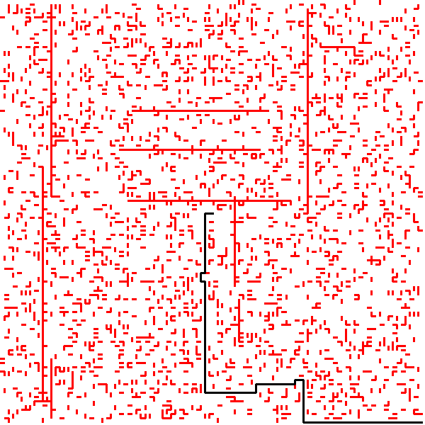

# Car Solver

## Requirement
* pillow

## Step to run
Chạy maze_solve.py với 2 tham số lần lượt `method` và `inputfile`. trong đó `method` chỉ nhận 1 trong 2 giá trị `ucf` hoặc `bfs`. VD:  
> python maze_solve.py ucf car_large

Khi chạy sẽ sinh bản đồ và path trong thư mục `images`

 

Output cho ucf car_large
> Error wall: [47, 89, 64, 71]  
> Error wall: [5, 90, 31, 42]  
> Error wall: [56, 98, 48, 7]   
> ...  (Các tường bị chéo không xét, do trong gen_map có k = 4 nhưng không được xử lý)  
> solving ...  
> Min cost: 239 Num step: 89 Done in 6.283495903015137  
> Found path:  
> -> (99, 99, 0, 0)  
> -> (99, 99, 3, 0)  
> -> (98, 99, 3, 1)  
> -> (96, 99, 3, 2)  
> -> (93, 99, 3, 3)  
> -> (89, 99, 3, 4)  
> -> (86, 99, 3, 3)  
> -> (82, 99, 3, 4)  
> -> (79, 99, 3, 3)  
> -> (77, 99, 3, 2)  
> -> (74, 99, 3, 3)  
> -> (72, 99, 3, 2)  
> -> (71, 99, 3, 1)  
> -> (71, 99, 3, 0)  
> -> (71, 99, 2, 0)  
> -> (71, 98, 2, 1)  
> -> (71, 96, 2, 2)  
> -> (71, 93, 2, 3)  
> -> (71, 91, 2, 2)  
> -> (71, 90, 2, 1)  
> -> (71, 90, 2, 0)  
> -> (71, 89, 2, 1)  
> -> (71, 89, 2, 0)  
> -> (71, 89, 3, 0)  
> -> (70, 89, 3, 1)  
> -> (70, 89, 3, 0)  
> -> (69, 89, 3, 1)  
> -> (69, 89, 3, 0)  
> -> (69, 89, 0, 0)  
> -> (69, 90, 0, 1)  
> -> (69, 90, 0, 0)  
> -> (69, 90, 3, 0)  
> -> (68, 90, 3, 1)  
> -> (66, 90, 3, 2)  
> -> (63, 90, 3, 3)  
> -> (61, 90, 3, 2)  
> -> (60, 90, 3, 1)  
> -> (60, 90, 3, 0)  
> -> (60, 90, 0, 0)  
> -> (60, 91, 0, 1)  
> -> (60, 91, 0, 0)  
> -> (60, 92, 0, 1)  
> -> (60, 92, 0, 0)  
> -> (60, 92, 3, 0)  
> -> (59, 92, 3, 1)  
> -> (57, 92, 3, 2)  
> -> (54, 92, 3, 3)  
> -> (52, 92, 3, 2)  
> -> (51, 92, 3, 1)  
> -> (49, 92, 3, 2)  
> -> (48, 92, 3, 1)  
> -> (48, 92, 3, 0)  
> -> (48, 92, 2, 0)  
> -> (48, 91, 2, 1)  
> -> (48, 89, 2, 2)  
> -> (48, 86, 2, 3)  
> -> (48, 82, 2, 4)  
> -> (48, 79, 2, 3)  
> -> (48, 77, 2, 2)  
> -> (48, 74, 2, 3)  
> -> (48, 72, 2, 2)  
> -> (48, 69, 2, 3)  
> -> (48, 67, 2, 2)  
> -> (48, 66, 2, 1)  
> -> (48, 66, 2, 0)  
> -> (48, 66, 3, 0)  
> -> (47, 66, 3, 1)  
> -> (47, 66, 3, 0)  
> -> (47, 66, 2, 0)  
> -> (47, 65, 2, 1)  
> -> (47, 65, 2, 0)  
> -> (47, 64, 2, 1)  
> -> (47, 64, 2, 0)  
> -> (47, 64, 1, 0)  
> -> (48, 64, 1, 1)  
> -> (48, 64, 1, 0)  
> -> (48, 64, 2, 0)  
> -> (48, 63, 2, 1)  
> -> (48, 61, 2, 2)  
> -> (48, 58, 2, 3)  
> -> (48, 56, 2, 2)  
> -> (48, 53, 2, 3)  
> -> (48, 51, 2, 2)  
> -> (48, 50, 2, 1)  
> -> (48, 50, 2, 0)  
> -> (48, 50, 1, 0)  
> -> (49, 50, 1, 1)  
> -> (49, 50, 1, 0)  
> -> (50, 50, 1, 1)  
> -> (50, 50, 1, 0)  
> Showing map and path  